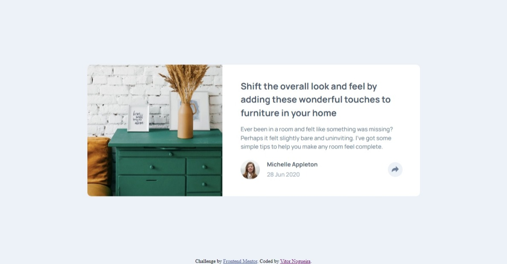

# Frontend Mentor - Article preview component solution

This is a solution to the [Article preview component challenge on Frontend Mentor](https://www.frontendmentor.io/challenges/article-preview-component-dYBN_pYFT). Frontend Mentor challenges help you improve your coding skills by building realistic projects. 

## Table of contents

- [Overview](#overview)
  - [The challenge](#the-challenge)
  - [Screenshot](#screenshot)
  - [Links](#links)
- [My process](#my-process)
  - [Built with](#built-with)
  - [Continued development](#continued-development)
- [Author](#author)

## Overview

### The challenge

Users should be able to:

- View the optimal layout for the component depending on their device's screen size
- See the social media share links when they click the share icon

### Screenshot

### Links

- Solution URL: [https://github.com/VitorEmanoelNogueira/article-preview-component-master](https://github.com/VitorEmanoelNogueira/article-preview-component-master)
- Live Site URL: [https://vitoremanoelnogueira.github.io/article-preview-component-master/](https://vitoremanoelnogueira.github.io/article-preview-component-master/)

## My process

### Built with

- Semantic HTML5 markup
- CSS custom properties
- BEM, OOCSS, SMACSS
- Flexbox
- Mobile-first workflow

### Continued development

I'll continue to focus on improving how I write the classes on HTML to better use BEM, OOCSS and SMACSS, on how to better implement the responsive design concepts I learned and continue to focus in developing my JavaScript skills.

## Author

- Frontend Mentor - [@VitorEmanoelNogueira](https://www.frontendmentor.io/profile/VitorEmanoelNogueira)
